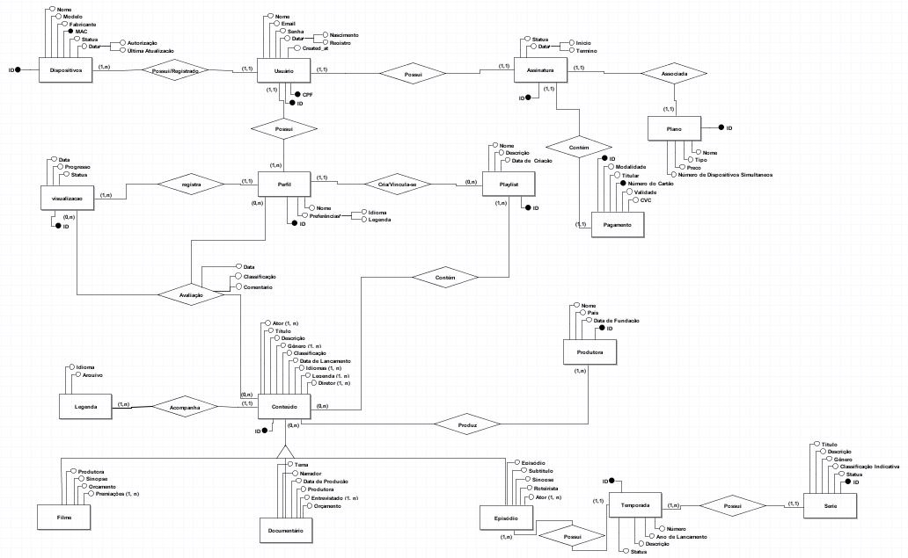

# **Streaming de Conteúdo: Aplicação de Vídeo**

O projeto visa desenvolver uma aplicação de streaming de vídeo, assemelhando-se a plataformas conhecidas como Netflix, Amazon Prime e Disney Plus. A aplicação será suportada por um banco de dados PostgreSQL, enquanto o backend da API será implementado em Node.js, utilizando JavaScript ou TypeScript, junto ao framework Express.

## Pré-requisitos

Antes de iniciar, certifique-se de ter os seguintes pré-requisitos instalados:

- **Node.js:** [Link para download](https://nodejs.org/)
- **npm (Node Package Manager):** [Link para download](https://www.npmjs.com/)
- **PostgreSQL:** [Link para download](https://www.postgresql.org/)

Certifique-se de ter essas ferramentas instaladas em seu ambiente para garantir o correto funcionamento da aplicação.

## Documentação do Banco de Dados

### Diagrama de Entidade e Relacionamento

### Projeto Lógico

O projeto lógico do banco de dados foi cuidadosamente elaborado para representar as entidades fundamentais e suas relações no sistema de streaming de vídeo. Cada tabela desempenha um papel crucial na organização e integridade dos dados, garantindo uma estrutura robusta e eficiente para a aplicação.

A seguir está o diagrama que ilustra a estrutura do projeto lógico:

